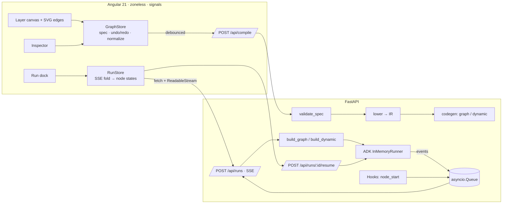

# Stratum architecture

## 1. What ADK 2.x changed

ADK 2.0 moved from a hierarchical agent executor to a **graph runtime**. `SequentialAgent`, `ParallelAgent` and `LoopAgent` still import but are deprecated in favour of `Workflow`:

```python
from google.adk import Agent, Context, Event, Workflow
from google.adk.workflow import JoinNode, node

root_agent = Workflow(
    name="research",
    edges=[
        ("START", planner, (web, market, risk), JoinNode(name="merge"), writer),  # chain + fan-out + join
        (router, {"billing": billing_agent, "technical": tech_agent}),           # Event(route="billing")
        (loop_gate, {"revise": writer, "done": publish}),                         # back-edge
    ],
)
```

Facts Stratum relies on (verified against `google-adk==2.9.0`):

- A tuple target `(a, b, c)` runs its nodes **concurrently**; a node with two plain incoming edges fires **once per edge**, so multi-input nodes need a `JoinNode`, which waits for all predecessors and emits `{name: output}`.
- A function node returns `Event(output=…, route=…, state=…, message=…)`. `output` becomes the next node's `node_input`; `route` selects dict edges; `state` persists in the session.
- `LlmAgent` inside a workflow uses `mode="single_turn"` (or `"task"`); `output_key` writes its reply to state.
- A node that yields `RequestInput` pauses the Runner. Resuming = sending a `function_response` named `adk_request_input` with the interrupt id, on the **same `invocation_id`**.
- Dynamic workflows: an `@node(rerun_on_resume=True)` function calls `await ctx.run_node(child, input)`; ADK checkpoints each child, so on resume finished children are not re-run.
- Runner events carry `node_info.path` (`"wf@1/web@1"`) and `output_for`; ADK only emits when a node **finishes**.

## 2. System overview



## 3. The GraphSpec

The UI edits one JSON document (`backend/stratum/spec.py`, mirrored in `frontend/src/app/core/models.ts`):

```jsonc
{
  "name": "Research Brief", "model": "gemini-2.5-flash",
  "layers": [
    { "kind": "stage",  "nodes": [ { "name": "planner", "instruction": "…" } ] },
    { "kind": "stage",  "nodes": [ web_researcher, market_analyst, risk_analyst ] },   // parallel
    { "kind": "stage",  "nodes": [ synthesizer ] },                                    // auto-joins all 3
    { "kind": "loop",   "maxIterations": 3,
      "nodes": [ { "name": "writer", "dependsOn": ["n_synthesizer", "n_planner"] },   // skip-level input
                 { "name": "editor" } ] },
    { "kind": "gate",   "nodes": [ { "name": "publish_approval", "kind": "human" } ] }
  ]
}
```

Layers are **dependency levels**: a node may only depend on earlier layers, so every spec is a DAG by construction and cycles only exist inside a loop layer. `dependsOn: null` means "every exit of the previous layer".

Validation (server-side, shown live in the UI): unique python-identifier names, router = 1 classifier + ≥2 routes whose targets sit in the next layer, loop = exactly generator + critic, gate = exactly one human node, no unreachable branch targets, no join that mixes an exclusive branch with always-running nodes (it would wait forever).

## 4. Lowering to the IR

`compiler.lower()` walks layers once and emits IR nodes + edges:

| Spec construct | IR |
|---|---|
| node with 1 input | `pred → node` |
| node with N inputs | `pred_i → join_<node>`, `join_<node> → node` |
| inputs that are *exclusive* router branches (one per label) | direct edges, no join (only one fires) |
| router layer | `router → route_<router>`; `route_<router> →[label] target` |
| loop layer | `gen → critic → loop_<gen>`; `loop_<gen> →[revise] gen`; exits via `[done]` |
| gate layer | `ask → decide_<ask>`; exits via `[approved]`, `[rejected]` ends the run |

Branch tags `(router, label)` propagate through single-input chains so convergence is detected downstream too.

The IR has two consumers: `build_graph()` (live ADK objects) and `codegen.graph()` (source). Because both read the same IR, the exported `agent.py` is structurally identical to what ran.

## 5. Engines

- **mock** — every `LlmAgent` becomes a `FunctionNode` that sleeps 0.45–1.35 s and synthesises deterministic text. Everything else — ADK scheduling, concurrency, joins, routes, back-edges, `RequestInput`, resume — is the real runtime. The mock router scores route labels + "when" text against the user input; the mock critic passes on round 2.
- **gemini** — real `LlmAgent(mode="single_turn", output_key=name, instruction=…)`. Router and critic instructions get a contract appended (reply with one label / start with `PASS` or `REVISE:`). Enabled when `GOOGLE_API_KEY`, `GEMINI_API_KEY` or Vertex env vars are present.

## 6. Streaming a run

ADK emits nothing when a node *starts*. Stratum wraps each node with a hook (`Hooks.start` inside mock/code nodes, `before_agent_callback` on LlmAgents) that pushes `node_start` into the same `asyncio.Queue` the Runner pump writes `node_end` into, so the SSE stream is ordered:

```
run_start → node_start planner → node_end planner → node_start web_researcher → node_start market_analyst → …
→ node_end loop_writer (internal, route "revise") → node_start writer (iteration 2) → …
→ interrupt publish_approval → run_end {status: "paused"}
POST /resume {interruptId, "approve"} → run_resume → node_end publish_approval → … → run_end {status: "completed"}
```

The frontend folds events into per-node `{status, spans[], iterations, output}`; the canvas colours nodes and animates edges from that state, and the timeline draws each span, so parallel stages visibly overlap.

## 7. "Dynamic" means three things

1. **Runtime-composed graphs** *(what Stratum does)* — the graph is data. Every request compiles the stored spec into a fresh `Workflow`; changing a graph needs no deploy. Specs can live per tenant/user in a database and be versioned.
2. **ADK dynamic workflows** *(Stratum's "Dynamic" compile target)* — control flow in Python: `await ctx.run_node(...)`, `asyncio.gather` for parallelism, `while` for loops, `if` for routing. Use when the shape depends on data (fan out over N items, retry until a check passes). Resumable because each `run_node` is checkpointed.
3. **Agent-planned graphs** *(the pattern this architecture enables)* — a planner model emits a GraphSpec for a task; the same `validate_spec` + `lower` gate it before compile, so a model can propose structure but never bypass the rules (no arbitrary code, bounded loops, typed routes). Graph mode also keeps routing out of the model entirely, which closes a prompt-injection path.

Rule of thumb: known shape → graph workflow (visual, reviewable, cheapest). Data-dependent shape → dynamic workflow. Unknown shape → planner emits a spec, humans or policy approve it, then it runs as a graph.

## 8. Production path

- Swap `InMemoryRunner` for a `Runner` with a persistent session service (database / Vertex AI) — HITL resume then survives restarts.
- Persist specs with a version id; runs record the spec version they compiled.
- Per-node `retry_config=RetryConfig(...)` and `timeout=`; `Workflow(max_concurrency=…)` to cap fan-out cost.
- Deploy the backend on Cloud Run or Vertex AI Agent Engine; the exported `agent.py` also runs under `adk web` / `adk api_server`.
- Gate promotion of a graph on ADK evaluation sets, the same way code is gated on tests.

## 9. Chat and Script: text front-ends to the same spec

```mermaid
flowchart LR
  E[English] -->|Gemini: writes Script| S
  E -->|no key: nl.build / nl.edit| G
  S[Stratum Script] -->|script.parse(text, base)| G[GraphSpec]
  G -->|script.format| S
  G --> V{diagnose}
  V --> P[Proposal: preview + diff] -->|Apply| C[Canvas / GraphStore]
```

- **One parser, server-side.** `script.parse` is the only way text becomes a spec (chat, Script view and tests all use it), so the model can never hand the UI something the parser and `diagnose()` did not accept. A Gemini reply that fails to parse is sent back once with the error, then falls back to the offline parser.
- **Merge with base.** Parsing matches layers (loose title key) and nodes (name) against the current graph and keeps anything the text does not state — ids, instructions, models, tools, route conditions. That makes `format(compact=True)` → edit → `parse(base=current)` lossless, which is what lets the Script view stay synced both ways.
- **Proposals, not mutations.** Chat never edits the canvas directly: every turn returns `{reply, spec, script, summary, diagnostics}`; the UI shows a mini layer preview with added/removed agents, and *Apply* goes through the normal undoable `GraphStore.load`.
- **Offline parser.** `nl.build` splits a request into clauses (`then`, `;`, `,` + verb …) and classifies each: approval → gate, route/triage → router + branches, draft+edit / loop / until → loop, combine/merge → code node, otherwise a stage whose agents come from counts (“4 analysts”) or lists (“with a web researcher, market analyst and risk analyst”). `nl.edit` handles add/insert/remove/rename/model/rounds against the current graph.

## 10. The static demo (GitHub Pages)

`npm run build:demo` builds the Angular app with `STRATUM_DEMO=true` and copies the ADK-free modules (`spec`, `ir`, `script`, `nl`, `codegen`, `templates`, `chat`, `sim`, `web`) into `py/`. At startup `DemoEngine` loads Pyodide + pydantic from jsDelivr, writes those files into Pyodide's filesystem and imports `stratum.web`; `ApiService` then routes every call there instead of HTTP. Compile, Python export, script parse/format and chat are the *same code* as the server. Runs go through `sim.py`, which executes the IR with ADK's edge semantics and emits the SSE event protocol, so the canvas, timeline and human-gate card are unchanged. `tests/test_sim.py` checks parity with the real runtime and that the browser modules never import `google.*`.
